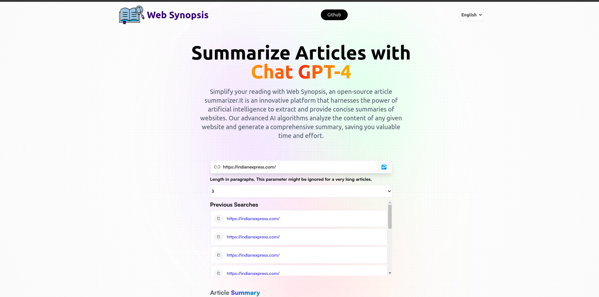

Web summarizer is an exciting AI technology that scans the entire website and extracts key information, condensing it into a succinct summary.

## Table of Contents

- [General Info](#general-info)
- [Technologies Used](#technologies-used)
- [Features](#features)
- [Screenshot](#screenshot)
- [Setup](#setup)
- [Contact](#contact)

## General Info

- Web summarizer is an exciting AI technology that scans the entire website and extracts key information, condensing it into a succinct summary.
- This feature enables users to quickly grasp the main points of a website without having to read through extensive content.
- Our algorithms are designed to identify and prioritize the most relevant and important sections of a website, ensuring that the generated summaries accurately capture the essence of the content.
- Users have the flexibility to choose the length and level of detail for the summaries generated by our platform. Whether you prefer a brief overview or a more detailed summary, our system adapts to your preferences.

## Technologies Used

```
- React JS
- Chat GPT 4.0
- CSS
- I18nNext
- Redux
```

## Features

- Scans the entire website and convert it into summary by harnessing the power of GPT 4.0
- Available in 5 Languages (English, Spanish, Hindi, Arabic, French)
- User can choose the length of the content

## Screenshot



## Setup

```
npm install
npm run dev
```

# Contact

created by [@faizkhan](https://www.faizkhan.xyz/)
